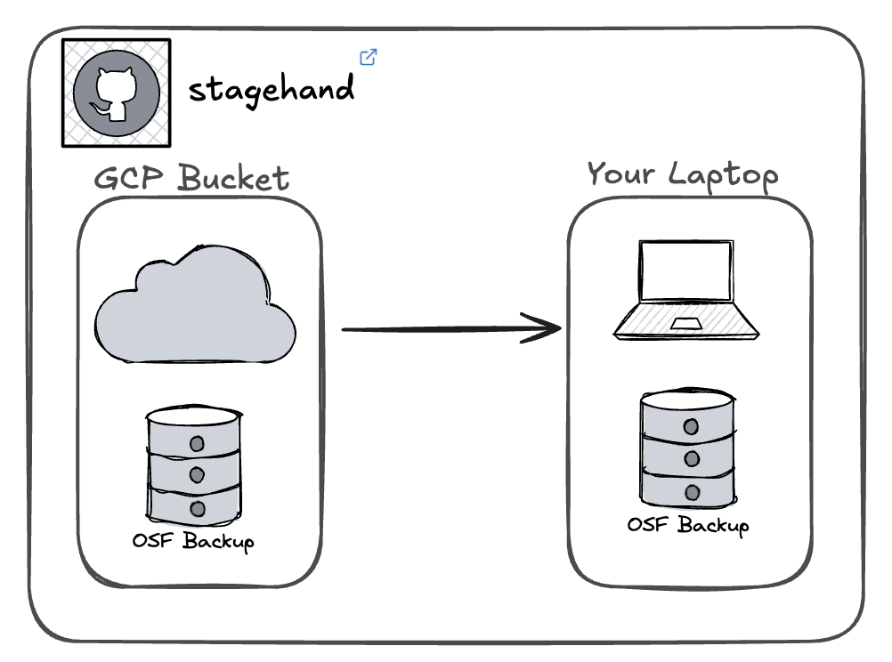

# stagehand

The `stagehand` pipeline helps automate the routine drudgery of downloading, extracting, and modifying the latest backup of the OSF database for local use.

{width="600"}

## Usage

### Pre-requisites

1.  The [`gcloud`](https://cloud.google.com/sdk/docs/install) command line tool installed and configured for your COS Google account.
2.  A properly staged data science environment for local use (see this [confluence page](https://openscience.atlassian.net/wiki/spaces/DS1/pages/3114762241/Create+data+science+environment) for details)

### Basic Workflow

`./run.sh` will run the entire pipeline. Please verify the default parameters defined at the top of the script are correct before running. Specifically:

-   `NTH_RECENT`: Which backup to download and extract, defined as the `n`th most recent backup. The default is to download the latest backup (`NTH_RECENT = 1`).
-   `DATADIR`: The top-level directory for all data and backups. The default is to use the `osfdata` directory in your home directory (`DATADIR = "${HOME}/osfdata"`).
-   `CODEDIR`: The top-level directory for the codebase. The default is to use the `osf.io` directory in your home directory (`CODEDIR = "${HOME}/osf.io"`).

By default, `./run.sh` will:

1.  Download and extract the backup
2.  Prepare the database for local use
3.  Load the database into Docker.

Each phase is governed by a boolean flag, which can be set to `0` to skip that phase.

### Customization

To simplify execution of the pipeline, you can set an alias in your `~/.zshrc` file:

``` bash
alias stagehand="cd <path/to/stagehand> && ./run.sh"
```

This will allow you to execute the pipeline from any directory by simply typing `stagehand` and passing in the arguments. For instance, to process the second most recent backup and set the database directory to `mydata`, you could run the following command in any directory:

``` bash
stagehand 2 mydata
```

## Directory Structure

-   `/run.sh` is the main entry point for the pipeline
-   `/img` contains images used in the README
-   `/pgfiles` contains helper files and configuration files for preparing the database for local use
-   `/scripts`
    -   `/get-backup.sh` downloads and extracts the backup
    -   `/prep-backup.sh` modifies the database for local use
    -   `/docker-backup.sh` loads the database into Docker

## Known Issues

### `scripts/get-backup.sh`

- Patch failure
- "Failure" to activate virtualenv

At present, neither of these issues are fatal and can be ignored.

```bash
error: patch failed: osf/utils/fields.py:28
error: osf/utils/fields.py: patch does not apply
Loading data into database...

Failed to activate virtualenv.

Perhaps pyenv-virtualenv has not been loaded into your shell properly.
Please restart current shell and try again.
```
